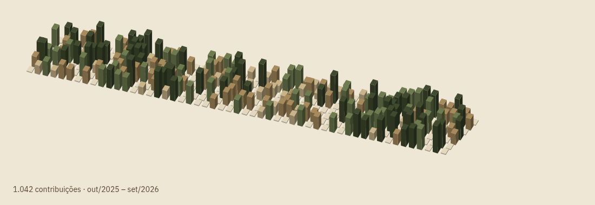

<!-- PROTÓTIPO descartável: ticket "Estrutura do README" (mapa #1). Não é o README final. -->

> **Protótipo** · [C. Duas colunas](C.md) ← **A. Carta em seções** → [B. Legenda de carta](B.md)
> Seções empilhadas, do geo para a IA, com os cards de stats abaixo do relevo.

---

Geotecnologias em Roraima. Drone e LiDAR em campo, ferramentas para agentes de IA no resto do tempo.

## Geo

O relevo não é coisa parada: é processo, e cada nuvem de pontos é um instante dele.

- **Plugins QGIS** para o trabalho que se repete toda semana.
- **Terraceamento a partir de MDE**: a curva de nível vira linha de máquina no campo.
- **Planejamento de missão LiDAR** com o Matrice 350. Milhões de pontos até que a quantidade vire terreno.
- **Geofísica**, onde o dado de superfície não basta.

## IA

Skills e ferramentas para o Claude Code.

| Projeto | O que faz |
|---|---|
| [**teach-me**](https://github.com/matheuszambonin/teach-me) | Skill que ensina qualquer assunto ao longo de várias sessões, com revisão espaçada e hábito de estudo. |
| **ars-latam** | *Em breve.* |

Estudando votação verificável em blockchain.

## Relevo das contribuições

  
  

---

<!-- CITACAO:INICIO -->
> Os filósofos apenas interpretaram o mundo de diferentes maneiras; o que importa é transformá-lo.
> K. Marx, *Teses sobre Feuerbach*, tese XI
<!-- CITACAO:FIM -->

✉ matheuszambonin@gmail.com
