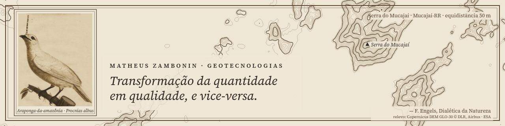
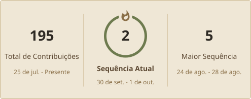

<!-- PROTÓTIPO descartável: ticket "Estrutura do README" (mapa #1). Não é o README final. -->

> **Protótipo** · [B. Legenda de carta](B.md) ← **C. Duas colunas** → [A. Carta em seções](A.md)
> Geo e IA lado a lado, com o mesmo peso. Os números ficam recolhidos num `
`. Elemento dinâmico: a **cobrinha** (o quadro abaixo marca o lugar dela, porque ela só existe depois que a Action roda).

---

<table>
<tr>
<td width="50%" valign="top">

### ▲ Geo

Drones, LiDAR e SIG no extremo norte. Quantidade de pontos até virar a qualidade de um terreno.

- Plugins QGIS
- Terraceamento a partir de MDE
- Missão LiDAR com Matrice 350
- Geofísica

</td>
<td width="50%" valign="top">

### ◇ IA

Skills e ferramentas para o Claude Code.

- [**teach-me**](https://github.com/matheuszambonin/teach-me): ensina qualquer assunto com revisão espaçada
- **ars-latam**: em breve
- Estudando votação verificável em blockchain

</td>
</tr>
</table>

<table width="100%"><tr><td align="center" height="140">
 🐍 <i>[ lugar da cobrinha (Platane/snk) comendo o calendário de contribuições, na rampa sépia ]</i>  
</td></tr></table>

<b>Números</b>

  
  
  

---

<table width="100%"><tr>
<td>
<!-- CITACAO:INICIO -->
<i>“Os filósofos apenas interpretaram o mundo de diferentes maneiras; o que importa é transformá-lo.”</i> 
K. Marx, <i>Teses sobre Feuerbach</i>, tese XI · citação da semana
<!-- CITACAO:FIM -->
</td>
<td align="right">✉ matheuszambonin@gmail.com</td>
</tr></table>
